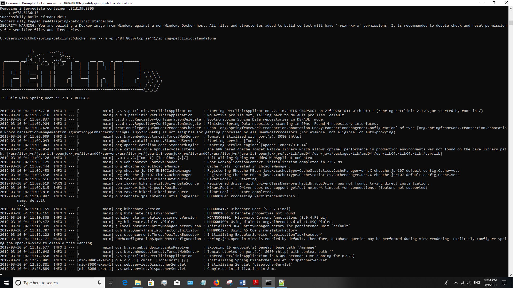
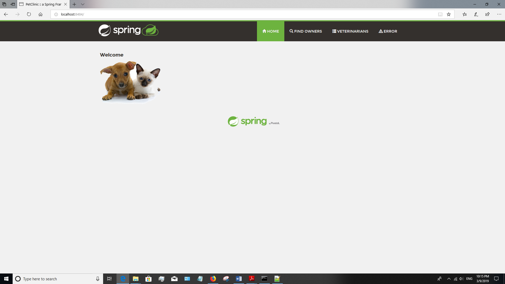
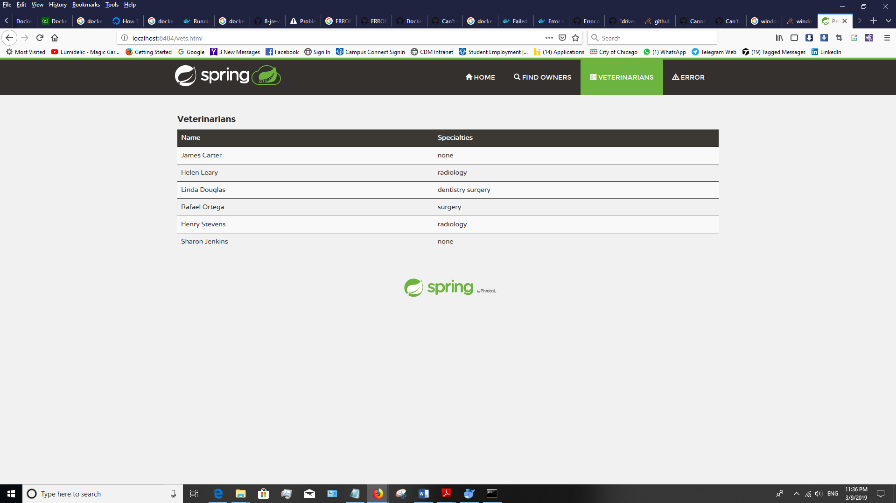
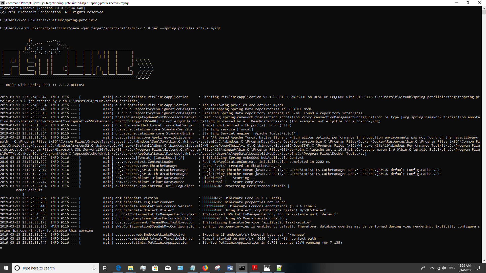
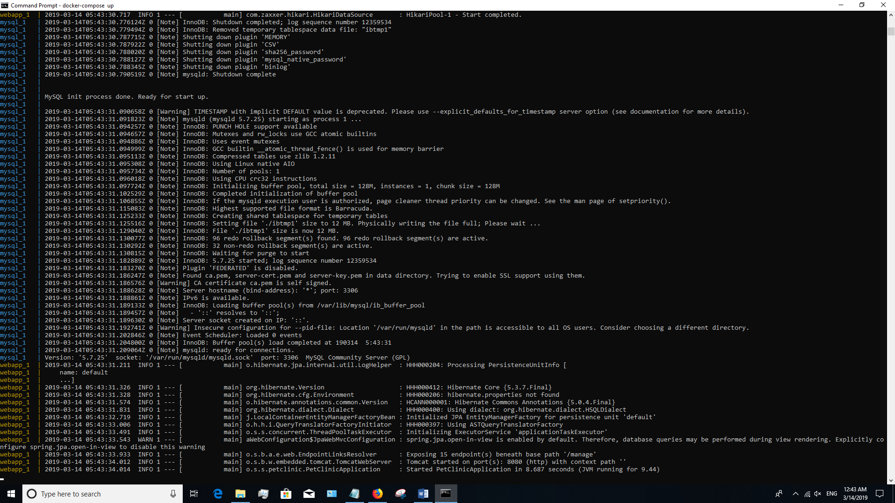
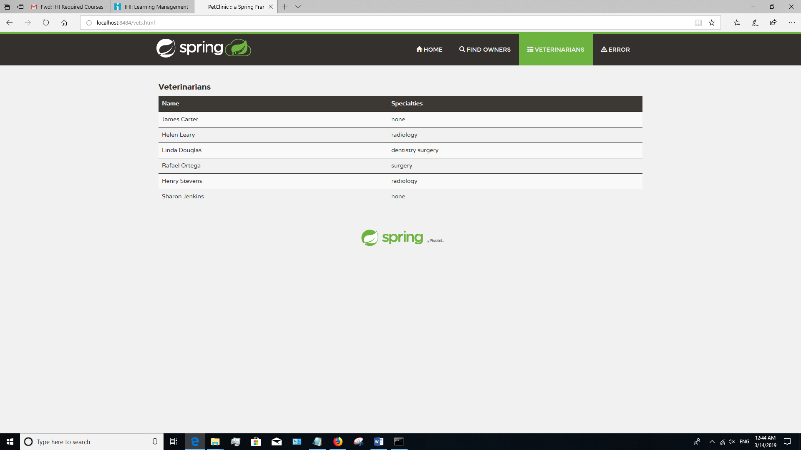

[Dockerfile](https://github.com/mo3026/spring-petclinic/blob/master/Dockerfile)

[docker-compose.yml](https://github.com/mo3026/spring-petclinic/blob/master/docker-compose.yml)
[application-mysql.properties](https://github.com/mo3026/spring-petclinic/blob/master/src/main/resources/application-mysql.properties)

