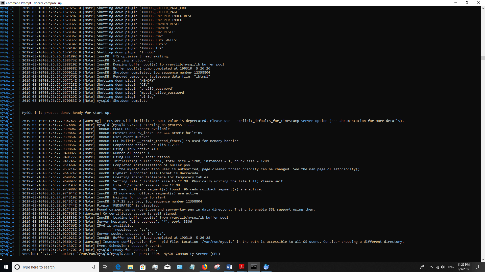

[Dockerfile](https://github.com/depaulcdm/hw4-mo3026/blob/master/hello-world/ivy.xml)

[docker-compose.yml](https://github.com/depaulcdm/hw4-mo3026/blob/master/hello-world/ivy.xml)
[application-mysql.properties](https://github.com/depaulcdm/hw4-mo3026/blob/master/hello-world/ivy.xml)

